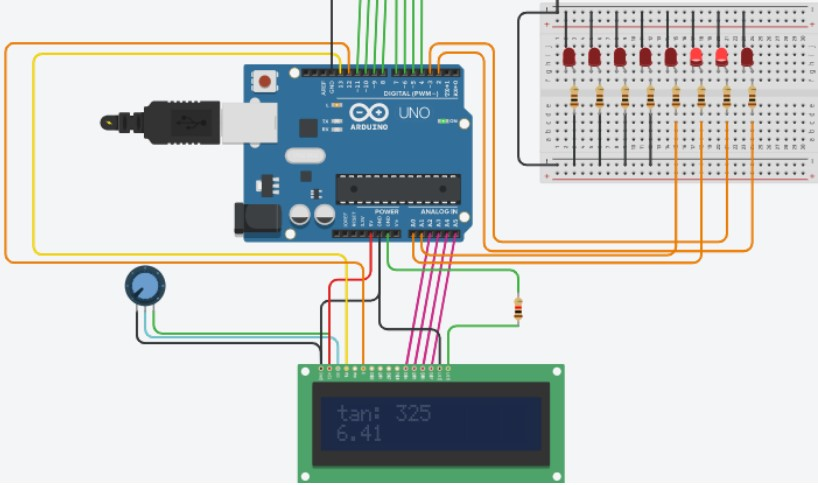

# Tinkercad-Arduino-Calculator

A simulation of a calculator in Tinkercad environment using Arduino Uno R3.

[Tinkercad Demo](https://www.tinkercad.com/things/8tuFfIZ6U8k-my-calculator/editel?sharecode=UtoDPzvrXSawMqOEGMpSEvul6iMbIizJn-03o0RwUQs)

  

## Operations

Combination of considering order of operations:
- Addition (+)
- Subtraction (−)
- Multiplication (×)
- Division (÷)
- Sin
- Cos
- Tan

## Technologies

- Tinkercad
- Arduino
- C programming language

## Components

- Keypad 4x4
- Arduino Uno R3
- LCD 16x2
- 1k Resistor
- 250k Potentiometer
- Red LEDs (8)
- 100 Resistors (8)
